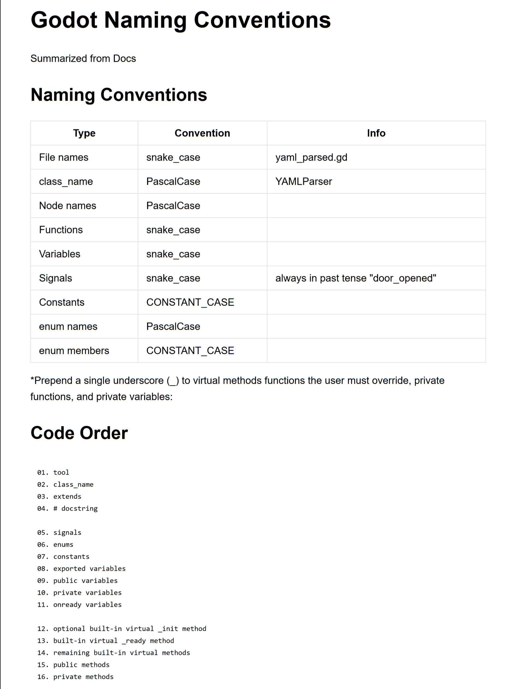

## TODO
- [x] Weapon system
  - [ ] Dropping / Equipping guns
  - [ ] More weapons
  - [ ] Fix weapon stats
  - [ ] try particle system to make effects
- [ ] Health and DMG system
  - [x] Create a component that handles that on any node
  - [x] Make work damage handling
  - [ ] effects or other dmg taking feedback
- [ ] Enemy
  - [ ] Create Enemy or/and Entity class
  - [ ] Implement basic states (stay, patrol, attack)
  - [ ] Design basic enemy (and npc perhaps)
  - [ ] Implement enemy spawn system (for if auto generated)
- [ ] UI
  - [x] Ammo
  - [x] Health 
  - [ ] Style menu (main/setting/start game)
- [x] Multiplayer
  - [x] Network manager
  - [x] Synchronize player
  - [x] Synchronize weapons
  - [ ] Synchronize enemies (states and movement)
  - [ ] Synchronize dmg
- [ ] Audio
  - [ ] Add sound effects
  - [ ] BG music?

## Docs
[old docs iguess](https://www.notion.so)

### Commits 

**Commit Individual Final Changes**: Aim to commit `"logical chunks"` of work as you complete them. You do not need to push each commit immediately, but ensure each commit represents a discrete, functional change.

**Please write clear commit messages to indicate what each commit does.**

**For example**:
Lets say you set out to create a new weapon and maybe fix few bugs. If you create a new weapon and make it functional, but haven't lets say completed the visuals, commit it anyway with a comprehensive message like `add crossbow functionality`.
If you later fix a bug, commit that fix separately with a message like `fix reload bug`.
When you then add visuals, animations, ect for the weapon, commit with a message such as `add crossbow visuals`.

**Regularly Push Changes**: Don't forget to push your commits regularly to the remote repository to ensure your work is backed up and accessible to everyone. 🐈🐈‍⬛

**Merge Conflicts**: If you encounter merge conflicts when pushing feel free to create new branch (if it still lets you) 
or back up your work other way, most conflicts are resolved automatically but in some cases you might be required to make them manually (usually you can just open them in vs code and then go through them).  

**Working on Large Features**: For substantial changes or features, create a separate branch. This allows for focused development without disrupting the main branch which also means that any of the work you make won't be lost or unused. Name branches descriptively, such as `feature/megabegabobega-feature` or `rework/weapon-system`.



### Server Guide

run in a container or vm using the `--server` flag. cmd example:

```bash
"project name.exe" --server
```

or

```bash
"project name.exe" --server --headless
```

### [Naming and Formatting conventions](https://docs.godotengine.org/en/stable/tutorials/scripting/gdscript/gdscript_styleguide.html)
